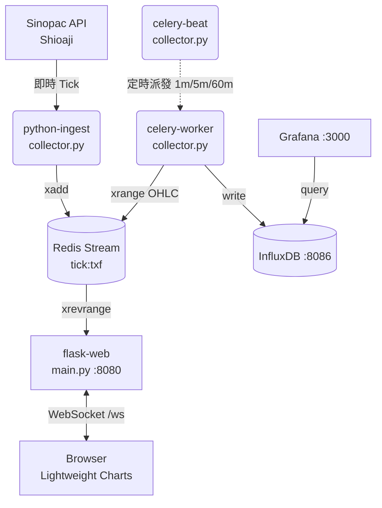

# TXF Pipeline

台指期 (TXF) 即時報價與 K 線圖資料管線系統，採用微服務架構，透過 Docker Compose 統一管理所有服務。

## 系統架構圖 (架構與流程)



1. **報價接收 (Python Ingest)**: 透過永豐金證券 Shioaji API，以模擬模式訂閱台指期 (TXF) 的即時 Tick 報價資料。接收到最新一筆報價後，會打入 Redis Stream `tick:txf` 中。
2. **訊息佇列 (Redis)**: 作為各服務之間的資料交換中心與暫存區，負責接收高頻率的即時報價，並提供給其他服務取用。
3. **即時推播服務 (Rust Service)**: 使用 Rust (Warp + Tokio) 建立的高效能 WebSocket Server (監聽在 `9000` 埠)。它會每 500ms 向 Redis 查詢最新的 Tick 報價，隨後即時推播給所有連接的 WebSocket 客戶端 (前端網頁)。
4. **前端展示層 (Frontend / Nginx)**: 放置靜態 HTML (透過 Nginx 掛載)。網頁透過 WebSocket 連接 Rust Service，即時接收 Tick 資料，並使用 TradingView 的 `lightweight-charts` 套件，在客戶端動態繪製成台指期 1 分鐘的 K 線圖 (Candlestick Chart)。
5. **歷史資料落地與聚合 (Python Celery / InfluxDB)**:
    - **Celery Beat / Celery Worker**: 以定期的背景任務 (Task)，分別以 1 分鐘 (`agg_1m`)、5 分鐘 (`agg_5m`)、60 分鐘 (`agg_60m`) 的時間區間，從 Redis 中抓取歷史 Tick 報價並計算開盤、最高、最低、收盤 (OHLC) 的組合。
    - **InfluxDB**: 專門用來儲存時間序列資料，儲存由 Celery 計算出的各週期 K 線資料至 `txf` Bucket 當中。
6. **數據視覺化儀表板 (Grafana)**: 監聽在 `3000` 埠，作為歷史資料的 BI 與視覺化工具，可以直接連接 InfluxDB 來呈現各週期的歷史 K 線圖或其他指標。

## 服務清單 (Docker Compose Services)

專案使用 `docker-compose.yml` 統一管理啟動，各服務功能與對應埠號如下：

| 服務名稱        | 當前版本號 | 連接埠號 (外:內) | 說明與用途 |
| --- | --- | --- | --- |
| **redis** | `7.2.4-alpine` | `6379:6379` | 高效能記憶體資料庫，做為即時 Tick 的串流佇列存儲。 |
| **influxdb** | `2.7.5-alpine` | `8086:8086` | 時間序列資料庫，存放計算好的各週期開高低收 (OHLC) 歷史資料。預設建立 `txf` Bucket。 |
| **grafana** | `10.4.1` | `3000:3000` | 用於圖表化檢視歷史 K 線與報價趨勢的 Dashboard 儀表板。 |
| **python-ingest** | `Python 3.11.8` | `N/A` | 使用 `shioaji` API 訂閱永豐金的台指期報價，轉拋至 Redis。 |
| **celery-worker** | `Python 3.11.8` | `N/A` | 負責執行資料聚合背景任務 (1m, 5m, 60m)，計算 OHLC 寫入 InfluxDB。 |
| **celery-beat** | `Python 3.11.8` | `N/A` | 排程派發器，負責定時呼叫 Celery Worker 執行聚合任務。 |
| **rust-service** | `Rust 1.75.0` | `9000:9000` | WebSocket 伺服器，對前端提供 `ws://localhost:9000/ws` 即時報價連線。 |
| **nginx** | `1.25.4-alpine` | `8080:80` | Web 伺服器，負責對外服務前端 (`frontend/index.html`)。 |

## 資料流向 (Data Flow)

**【即時圖表呈現流程】**
`Shioaji API` -> `Python Ingest` -> `Redis` (tick:txf) -> `Rust Service` (WebSocket) -> `Frontend` (Chart)

**【歷史紀錄與聚合流程】**
`Redis` (tick:txf) -> `Celery Worker/Beat` 取出一段區間的資料計算 OHLC -> 寫入 `InfluxDB` -> 透過 `Grafana` 查詢與呈現

## 開發技術棧 (Tech Stack)

- **核心語言**: Python, Rust (高效能併發), HTML/JS
- **資料庫/快取**: Redis, InfluxDB 2
- **排程與非同步任務**: Celery
- **API 與連線**: WebSocket (Warp 框架), Shioaji API (取得台股報價)
- **前端圖表**: TradingView Lightweight Charts
- **基礎設施**: Docker, Docker Compose, Nginx

## 執行與部署指引

1. 確保已安裝 Docker 及 Docker Compose。
2. 進入專案根目錄 (即 `docker-compose.yml` 所在位置)。
3. 在 `python/ingest.py` 內將 `api.login("API_KEY", "SECRET_KEY")` 換成您能合法使用的 Shioaji API Key 憑證 (現為模擬模式 `simulation=True`)。
4. 執行命令啟動所有服務：
```bash
docker-compose up -d --build
```

### 4. 存取服務

| 服務 | 網址 |
|---|---|
| 即時 K 線前端 | http://localhost:8080 |
| Grafana 儀表板 | http://localhost:3000 |
| InfluxDB 控制台 | http://localhost:8086 |

> **Grafana 預設帳號**：admin / admin123  
> **InfluxDB 預設帳號**：admin / admin123

## 開發

安裝開發依賴：

```bash
pip install -r requirements.txt -r requirements-dev.txt
```

執行測試：

```bash
pytest tests/
```

## 技術棧

| 類別 | 技術 |
|---|---|
| 語言 | Python 3.11 |
| Web 框架 | Flask + flask-sock (WebSocket) |
| 排程 | Celery + Redis Broker |
| 報價 API | Sinopac Shioaji |
| 快取 / 佇列 | Redis Stream |
| 時序資料庫 | InfluxDB 2.x |
| 視覺化 | Grafana |
| 前端圖表 | TradingView Lightweight Charts |
| 容器化 | Docker + Docker Compose |