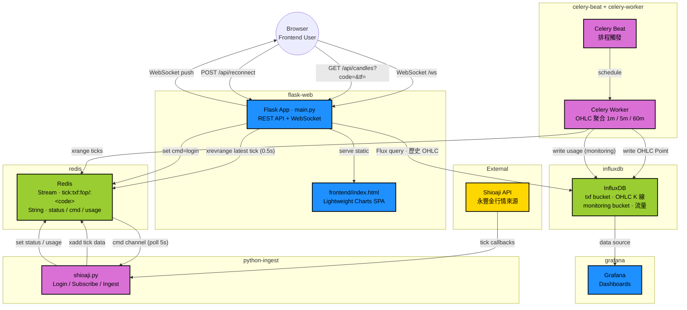

# TXF Pipeline — 系統架構

```mermaid
graph TB
%% === STYLES ===
classDef core    fill:#1E90FF,stroke:#000,color:#000,stroke-width:2px;
classDef db      fill:#9ACD32,stroke:#000,color:#000,stroke-width:2px;
classDef external fill:#FFD700,stroke:#000,color:#000,stroke-width:2px;
classDef worker  fill:#DA70D6,stroke:#000,color:#000,stroke-width:2px;

%% === USER ===
User(("Browser\nFrontend User"))

%% === EXTERNAL DATA SOURCE ===
subgraph "External"
  ShioajiAPI["Shioaji API\n永豐金行情來源"]:::external
end

%% === DOCKER: python-ingest ===
subgraph "python-ingest"
  Shioaji["shioaji.py\nLogin / Subscribe / Ingest"]:::worker
end

%% === DOCKER: celery-beat + celery-worker ===
subgraph "celery-beat + celery-worker"
  CeleryBeat["Celery Beat\n排程觸發"]:::worker
  CeleryWorker["Celery Worker\nOHLC 聚合 1m / 5m / 60m"]:::worker
end

%% === DOCKER: flask-web ===
subgraph "flask-web"
  FlaskApp["Flask App · main.py\nREST API + WebSocket"]:::core
  Frontend["frontend/index.html\nLightweight Charts SPA"]:::core
end

%% === DOCKER: redis ===
subgraph "redis"
  Redis["Redis\nStream · tick:txf:fop/<stk>:&lt;code&gt;\nString · status / cmd / usage"]:::db
end

%% === DOCKER: influxdb ===
subgraph "influxdb"
  InfluxDB["InfluxDB\ntxf bucket · OHLC K 線\nmonitoring bucket · 流量"]:::db
end

%% === DOCKER: grafana ===
subgraph "grafana"
  Grafana["Grafana\nDashboards"]:::core
end

%% === DATA FLOW ===
ShioajiAPI  -->|"tick callbacks"| Shioaji
Shioaji     -->|"xadd tick data"| Redis
Shioaji     -->|"set status / usage"| Redis
Redis       -->|"cmd channel (poll 5s)"| Shioaji

CeleryBeat  -->|"schedule"| CeleryWorker
CeleryWorker -->|"xrange ticks"| Redis
CeleryWorker -->|"write OHLC Point"| InfluxDB
CeleryWorker -->|"write usage (monitoring)"| InfluxDB

FlaskApp    -->|"xrevrange latest tick (0.5s)"| Redis
FlaskApp    -->|"WebSocket push"| User
FlaskApp    -->|"Flux query · 歷史 OHLC"| InfluxDB
FlaskApp    -->|"serve static"| Frontend

User        -->|"WebSocket /ws"| FlaskApp
User        -->|"GET /api/candles?code=&tf="| FlaskApp
User        -->|"POST /api/reconnect"| FlaskApp
FlaskApp    -->|"set cmd=login"| Redis

InfluxDB    -->|"data source"| Grafana
```
